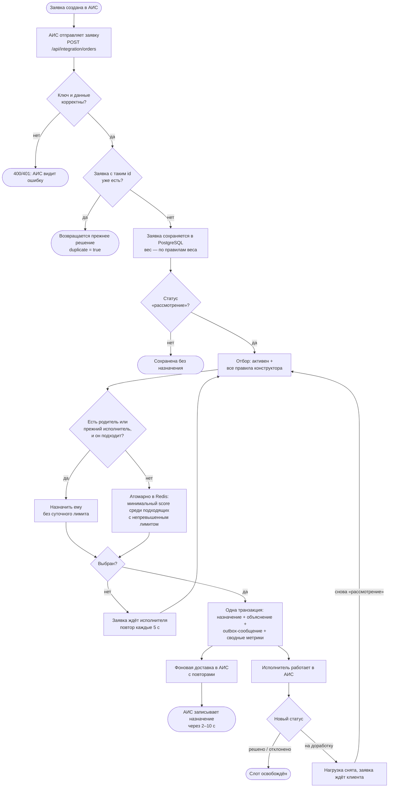
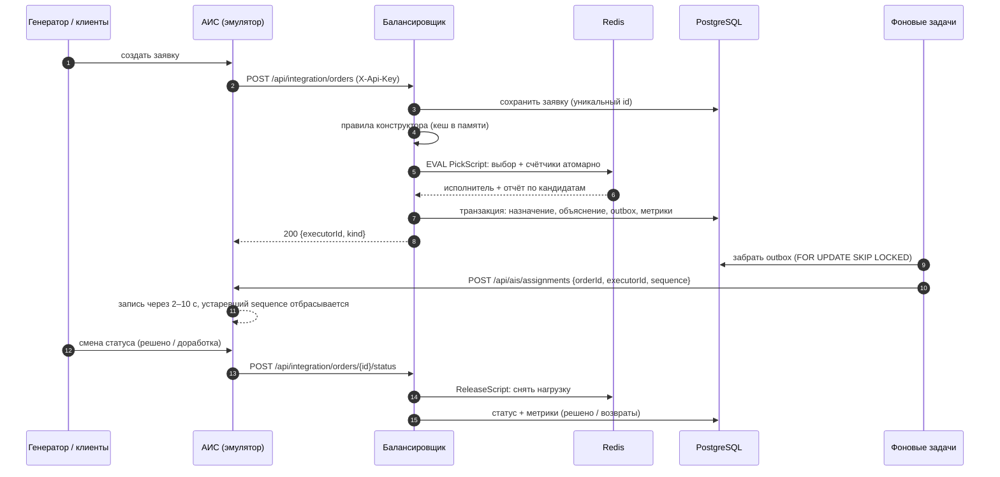
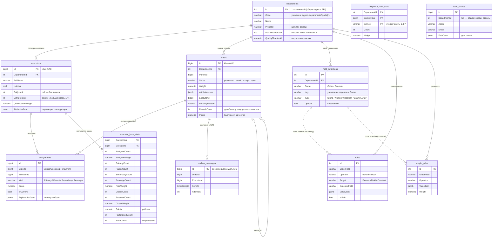

# Архитектура Executor Balancer

Диаграммы — в Mermaid: GitHub показывает их картинками, для презентации их можно открыть в mermaid.live
и сохранить как PNG/SVG.

## Процесс распределения (BPMN)

Отдельные ветки: деактивация исполнителя в АИС сразу перераспределяет его открытые заявки
(тип «перераспределение»); изменение правил в конструкторе применяется ко всем следующим решениям
на всех экземплярах в течение секунды.

## Взаимодействие (sequence)

## Модель данных (ERD)

### Отделы

Отдел — независимое пространство: справочник параметров, правила, веса, сотрудники, заявки и отчёты
фильтруются по `DepartmentId`. Снимок конфигурации в `ExecutorDirectory` строится на отдел; версия
конфигурации в Redis общая — любое изменение перечитывает снимки всех отделов (изменения редкие).
Нагрузка в Redis хранится по ID исполнителя: идентификаторы в АИС общие, а исполнитель состоит в одном
отделе, поэтому ключи Lua-скриптов не меняются. Перевод исполнителя в другой отдел, как и деактивация,
перераспределяет его открытые заявки внутри их отдела.

## Алгоритм

1. **Отбор.** Активные исполнители, для которых выполнены все включённые правила конструктора.
   Правило — «поле заявки, оператор, поле исполнителя или значение». Операторы: равно, не равно,
   больше, не меньше, меньше, не больше, одно из, не из, содержит, в диапазоне. Типы проверяются
   при сохранении правила, поэтому на заявке правило не может «упасть».
2. **Родитель и вторичные.** Если есть `parent_id` или заявка вернулась с доработки, и тот исполнитель
   подходит — заявка уходит ему, суточный лимит не учитывается (возврат с доработки и в счётчик не входит).
3. **Выбор.** Сначала среди подходящих, кто не набрал суточную норму; если таких нет — среди сотрудников
   в режиме «больше нормы», не достигших потолка `норма + N%` (только излишки). В ярусе — минимальный
   `score = (вес, полученный за текущий час, + вес заявки) / квалификация` — ровно то, что отчёт сравнивает со
   справедливой долей. При равенстве — меньше открытой нагрузки, затем назначений за сутки, затем меньший id. Сравнение без деления (перекрёстным умножением) в целых тысячных — Lua и C#
   дают одинаковый результат.
4. **Атомарность.** Выбор и увеличение счётчиков — один Lua-скрипт в Redis. Несколько экземпляров сервиса
   не могут отдать одного «свободного» исполнителя дважды или превысить лимит.
5. **Надёжность.** Решение, объяснение, сообщение для АИС и метрики — в одной транзакции PostgreSQL. Если
   транзакция не прошла — счётчики в Redis откатываются, включая суточный. Если процесс упал между Redis
   и базой, через минуту повторное распределение видит «осиротевшую» запись, откатывает её и назначает заново.

### Справедливость: как считается отклонение

Эталон — **идеально выровненное распределение того же потока** (max-min fair allocation): нагрузка на
единицу квалификации как можно ровнее с учётом того, кто какие заявки мог взять, кто в это время работал,
и что упёршийся в суточный лимит больше получить не мог. Заявки от родителя и вторичные обязаны идти
«своему» исполнителю — в эталоне это уже занятая часть нагрузки.

Для этого при каждом свободном выборе сохраняется набор исполнителей, которые могли взять заявку
(`eligibility_hour_stats`). Эталон — минимум Σ (bᵢ + xᵢ)² / qᵢ, где bᵢ — назначения без выбора, xᵢ — доля
из групп, qᵢ — квалификация; решается покоординатным спуском (`FairShare`).

Отклонение исполнителя = (назначенный вес − справедливый) / справедливый. Среднее — Σ|разниц| / Σ справедливых.

Пропорциональный делёж каждой заявки между подходящими как эталон не годится: если один исполнитель
берёт кредиты и карты, а другой только кредиты, справедливо отдавать кредиты в основном второму, а
пропорциональная схема назвала бы это перекосом в десятки процентов.

### Сильные стороны и ограничения

- Решение за миллисекунды и объяснимо: у каждого назначения сохранены score всех кандидатов и причины отказа.
- Новые параметры и правила — без правки кода и перезапуска.
- Выравнивается **текущая** нагрузка (открытые заявки), как требует правило «меньше открытых заявок». Кто
  закрывает быстрее, получает больше — это честно по нагрузке, но итоговые доли за день зависят и от скорости
  работы исполнителей, поэтому на коротком интервале отклонение от эталона больше, чем на длинном.
- Узкий специалист получает заявки только в «свои» моменты и немного недобирает — дискретность онлайн-выбора.

## Ключевые проблемы и альтернативы

| Проблема | Решение | Альтернативы и почему не они |
|---|---|---|
| АИС узнаёт о назначении через 2–10 с | нагрузку ведём у себя, в Redis | читать нагрузку из АИС — при всплеске один исполнитель получит десятки заявок |
| Гонки между потоками и экземплярами | Lua-скрипт: выбор + счётчики атомарно | `SELECT … FOR UPDATE` в PostgreSQL — корректно, но сериализует все решения на строках исполнителей; распределённые блокировки — сложнее и медленнее |
| Параметров много, появляются новые | справочник полей + правила как данные | поля колонками в таблице — миграция на каждый параметр; `eval` выражений — дыра в безопасности |
| Решение сохранено в Redis, но не в базе | откат счётчиков; восстановление «осиротевших» | двухфазная фиксация — избыточна для одного Redis |
| Доставка в АИС может не пройти | outbox в той же транзакции + повторы | прямой вызов АИС в запросе — потеря назначения при сбое сети |
| Устаревшее назначение приходит позже нового | номер сообщения (sequence), АИС применяет только более новый | — |
| Отчёты по большому потоку | почасовые агрегаты в той же транзакции | считать по истории назначений — дорого на каждый запрос |
